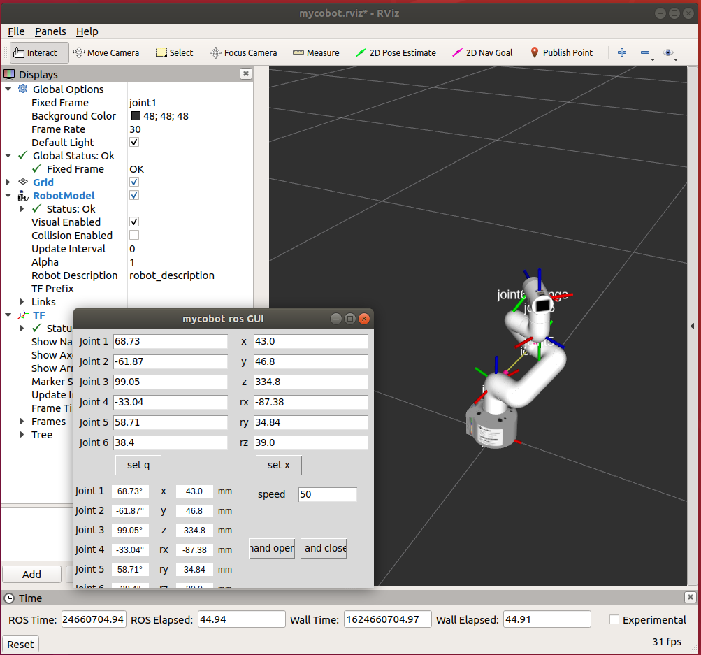

# `myCobot` setup

Kinda hacky, but meh.

## References

- Product Page: <https://www.elephantrobotics.com/en/myCobot-en/>
- GitBook: <https://www.elephantrobotics.com/docs/myCobot-en/>
- Firmware:
    - Open source flasher: <https://github.com/zlj-zz/minimycobotflasher>
    - Proprietary flasher: <https://github.com/elephantrobotics/myStudio/>
    - Arduino source for Basic binaries: <https://github.com/elephantrobotics/myCobot/tree/main/Arduino/MycobotBasic>
- Python driver: <https://github.com/elephantrobotics/pymycobot>
- ROS interface: <https://github.com/elephantrobotics/mycobot_ros>

## Setup: Ubuntu 18.04

### Permissions

Ensure you are part of the `dialout` group:

- Arduino Instructions: <https://www.arduino.cc/en/guide/linux#toc6> <br/>

        sudo usermod -a -G dialout $USER

  Most likely, you may need to reboot. Be sure to check your system, e.g.:

        $ id
        uid=1001(myuser) gid=1002(myuser) groups=1002(myuser),20(dialout),27(sudo)

  - Extra references:
    - <https://askubuntu.com/questions/133235/how-do-i-allow-non-root-access-to-ttyusb0>
    - <https://superuser.com/questions/272061/reload-a-linux-users-group-assignments-without-logging-out>

### Prereqs

```sh
sudo apt install python3-virtualenv

# Install ROS 1 Melodic per nominal instructions.
# Some possible packages:
sudo apt install $(echo "
    ros-melodic-control-msgs
    ros-melodic-cv-bridge
    ros-melodic-image-transport
    ros-melodic-joystick-drivers
    ros-melodic-robot-state-publisher
    ros-melodic-ros-base
    ros-melodic-rviz
    ros-melodic-tf2-msgs
    ros-melodic-tf2-py
    ros-melodic-visualization-msgs
    ros-melodic-xacro
    ")
```

### Flash Firmware

*Note*: You do **not** need to install the `CP2104` kernel USB driver (from
[M5Stack website](https://docs.m5stack.com/en/arduino/arduino_development)). It
should work without it.

See diagram: 
<https://www.elephantrobotics.com/docs/myCobot-en/2-preparation/2-mycobot_hardware/2-mycobot_hardware.html>

```sh
# In any directory.

git clone https://github.com/eacousineau/minimycobotflasher -b wip
cd minimycobotflasher
git checkout 6cd9433  # This hack branch has the *.ino.bin files commited.

# Local setup.
python3 -m virtualenv -p python3 ./venv
source ./venv/bin/activate
pip3 install -r ./requirements.txt

# Plug in USB-C into Basic board.
python3 ./main.py
# board: basic (0)
# port: (default should be OK)
# location: local (0, default)
# app: Transponder (2)
# version: v1.0 (0)

# Now the LCD screen on base should read "myCobot Basic Transponder".

# Now plug into USB-C on Atom board.
python3 ./main.py
# board: atom (1)
# port: (default should be OK)
# location: local (0, default)
# app: AtomMain (1)
# version: v2.8 (0)

# Now plug back into USB-C into Basic.

# Now close this bash session.
```

### ROS 1 Melodic in `virtualenv`

Incorporates my gripes here:
<https://github.com/elephantrobotics/mycobot_ros/issues/17>

This also installs `pymycobot`.

```sh
# In any directory.
# Make sure this is in a *new* session.

source /opt/ros/melodic/setup.bash

mkdir -p mycobot_ros_workspace/src
cd mycobot_ros_workspace/src

git clone https://github.com/eacousineau/mycobot_ros -b wip
cd mycobot_ros
git checkout 9cf8b05  # Removes unnecessary for deps for ctrl.
# N.B. Also, when I (Eric) try to install MoveIt!, it horks my system.

cd ../..
catkin_make -j
# Hack merge a Python3 virtualenv into ROS workspace.
# WARNING: This will use Python 3. It's fine for most ROS1 Melodic stuff, but
# any CPython API extensions will break.
python3 -m virtualenv -p python2 --system-site-packages ./devel

# Now source into workspace *AND* virtualenv.
source ./devel/setup.bash
source ./devel/bin/activate
# Install add'l prereq.
pip install pymycobot==2.5.3
# Smoke test.
python -c 'import rospkg; import pymycobot'
```

## Testing it out

```sh
cd mycobot_ros_workspace/
source ./devel/setup.bash
source ./devel/bin/activate

cd src/mycobot_ros
# Run test program.
python ./scripts/test.py

# now launch basic visualization.
roslaunch mycobot_ros mycobot_simple_gui.launch
```


