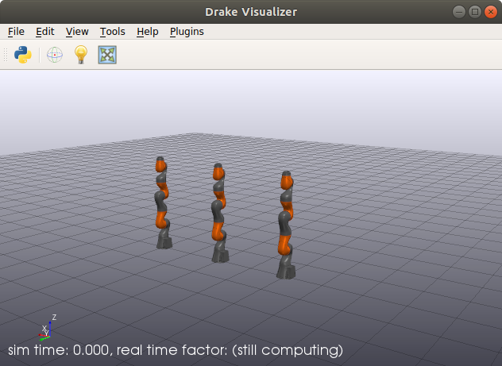

# Unofficial Hacky Example of Drake + ROS1

For official ROS1 support, see / comment on:
https://github.com/RobotLocomotion/drake/issues/9500

Only tried out on Ubuntu 18.04, ROS1 Melodic, Python 3.6. This is Python-only,
no C++.

This has no "real" build system. Only hacks to make to the minimal amount of
ROS1 Melodic's Python 2 implementation work in Python 3.6 on Ubuntu.s

## Features

* Rviz Visualization using `QueryObject`

## Setup

Make sure you have ROS1 Melodic installed. Here's a command (copy parentheses
too) for 18.04 that should make it work:

```sh
( set -eux;
    if [[ ! -f /etc/apt/sources.list.d/ros-latest.list ]]; then
      echo "Adding ROS APT repository ..."
      echo "deb http://packages.ros.org/ros/ubuntu $(lsb_release -sc) main" > /etc/apt/sources.list.d/ros-latest.list
      sudo apt update
    fi
    sudo apt install $(
        echo ros-melodic-ros-base
        echo ros-melodic-tf2-msgs
        echo ros-melodic-tf2-py  # Requires Python 3 rebuild in `ros_py`.
        echo ros-melodic-visualization-msgs
        echo ros-melodic-rviz
    )
)
```

**TODO(eric.cousineau)**: Use Noetic for real Python 3 support.

Also install Drake prereqs. This procedure hacks stuff from:
<https://drake.mit.edu/python_bindings.html#inside-virtualenv>

Then source setup:

    source ./setup.sh

This is a super hacky thing, but it's minimal, and adds stuff in `./venv`.

It requires the sutff from `../ros1_py3_rebuild` to work (i.e. Docker).

## Demo

Then to run, launch both Drake Visualizer and Rviz:

    # Terminal 1
    ./venv/bin/drake-visualizer

    # Terminal 2
    ./setup.sh roscore

    # Terminal 2
    ./setup.sh rviz -d ./rviz_demo.rviz

Then run the demo (pass `-h` to look at options):

    ./setup.sh python3 ./rviz_demo.py

Here's what `--single_shot` looks like `drake-visualizer` and `rviz`:

 
